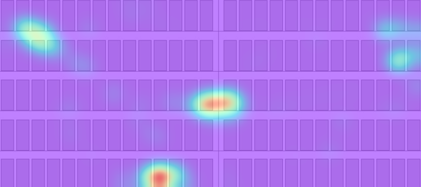

# heatmap for eye tracker

## How to use it ???
    python main.py -j ../demo/data/HeatMapData.txt \
    -bg ../demo/data/shelf_goods5.JPG \
    -o ../demo/result/heatmap.png

## Result ???

## Also
1. I've added some function to define your own cmap in utils/image_utils.py,
i.e. 
    def get_cmap_jet_asarray():
        colormap_float = np.zeros((256, 3), np.float)
        for i in range(0, 256, 1):
            colormap_float[i, 0] = cm.jet(i)[0]
            colormap_float[i, 1] = cm.jet(i)[1]
            colormap_float[i, 2] = cm.jet(i)[2]

        return colormap_float

    def change_cmap():
        colors = get_cmap_jet_asarray()
        for i in range(233, len(colors)):
            colors[i] = [1.0, 0.0, 0.0]

        cmap_name = 'my_list'
        cm = mcolors.LinearSegmentedColormap.from_list(cmap_name, colors, N=100)
        return cm

I choose jet for the reason that my visual designer choosed this~~.